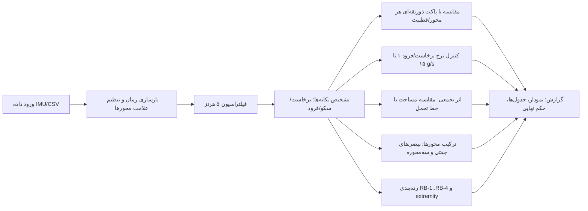

# RideSafe-Bio — فاز صفر: شناخت مسئله، مطالعه استاندارد، نیازمندی‌ها و ابهام‌ها

**جایگاه این سند:** پاسخ مهندسی به چهار خواسته‌ی فاز صفر بر پایه‌ی سند مرور مدارک (`01-standards-and-paper-summary.md`)، بازنگری ۲ — پس از دریافت و تحلیل کامل ISO/CD 17929:2026. پیاده‌سازی کد جزو این فاز نیست.
**آخرین بازنگری:** 2026-09-08

---

## ۱. شناخت مسئله

### ۱.۱ صورت مسئله
نرم‌افزاری می‌سازیم که **سیگنال شتاب سه‌محوره‌ی ثبت‌شده از سرنشین یک وسیله‌ی تفریحی** (IMU یا ورود دستی) را می‌گیرد و تعیین می‌کند مواجهه‌ی سرنشین از نظر **معیارهای دامنه‌ای** (دامنه تکانه)، **معیارهای زمانی** (مدت، نرخ برخاست/فرود، تکرار، اثر تجمعی) و **ترکیب محورها** مطابق **ISO/CD 17929:2026** قابل قبول است یا باید به بررسی مهندسی ارجاع شود. چون ISO 17842 حاکم (prevail) است، نتایج باید در سلسله‌مراتب استانداردِ مبنا نیز گزارش شود.

### ۱.۲ تعریف مرزهای سیستم
| ورودی | خروجی |
|---|---|
| فایل داده (CSV/TXT): زمان یا نرخ نمونه‌برداری + ax, ay, az | حکم ارزیابی: PASS / FAIL / نیاز به بررسی مهندسی |
| متادیتا: جهت‌گیری سنسور، نوع وسیله (خانوادگی/extreme)، رده RB مدنظر | نمودارهای علامت‌گذاری‌شده (تکانه‌ها، پاکت‌ها، نقض‌ها) |
| پروفایل/نسخه‌ی استاندارد (پیکربندی) | جدول تکانه‌ها، نقض‌ها، رده‌بندی RB و extremity، جدول ردیابی |

### ۱.۳ جریان پردازش (مرجع معماری — پارادایم 17929)

### ۱.۴ تفاوت بنیادی این پروژه با کار قبلی
کار قبلی پیوست I را با «قطعه‌بندی bin» پیاده کرد؛ اما پارادایم 17929 چیز دیگری است: واحد تحلیل **تکانه شتاب (acceleration impulse)** با سه ناحیه‌ی برخاست/سکو/فرود است و پاکت مجاز **ذوزنقه‌ای** است که نرخ برخاست/فرود را هم لحاظ می‌کند. یعنی موتور ارزیابی از صفر طراحی می‌شود؛ فقط پیش‌پردازش (فیلتر ۵ هرتز، نگاشت محورها) و لایه‌ی گزارش با کار قبلی مشترک مفهوم‌اند. دو پیامد معماری:
1. **حدود و پاکت‌ها داده (config) بمانند** — متن WIP است و خط B و B.23 هنوز نمودار ندارند؛ با انتشار نسخه نهایی فقط پیکربندی تغییر کند.
2. **ردیابی‌پذیری قاعده‌به‌قاعده** (کدام تکانه، کدام شکل/بند، کدام حد).

---

## ۲. مطالعه استاندارد — قواعد قابل پیاده‌سازی (از ISO/CD 17929:2026)

| # | قاعده | منبع |
|---|---|---|
| V1 | پیش‌پردازش: اندازه‌گیری طبق ASTM F2137 یا GOST R 56066-2014؛ **فیلتراسیون ۵ هرتز**؛ محور Z در راستای ستون فقرات (شکل 3)؛ نگاشت/وارونگی محورها | بند 7.3، Table B.1 Note 3 |
| V2 | تشخیص تکانه‌ها در هر محور/قطبیت: نواحی برخاست و فرود + سکو (Figure B.1)؛ تکانه می‌تواند تکانه‌های محلی کوچک‌تر دربر بگیرد | B.4 |
| V3 | پاکت مجاز ذوزنقه‌ای: سکو = دامنه/مدت؛ اضلاع بیرونی = نرخ حداقلی **1 g/s**؛ اضلاع داخلی = نرخ بیشینه (**7 g/s خانوادگی، 10 g/s عمومی، تا 15 g/s extreme**) | B.5 |
| V4 | اطمینان تکانه: دامنه ≤ ارتفاع پاکت؛ نرخ‌ها بین خطوط حداقل/حداکثر؛ 1–7 g/s ⇒ «مجاز و راحت» | B.7 |
| V5 | پروفایل چندتکانه‌ای: جا نشدن زیر یک کانتور ⇒ جداسازی با اختلاف دامنه ≤ 2g (متن WIP غلط تایپی دارد) و نرخ ≤ 7 g/s؛ کنترل شیب گروه تکانه‌ها | B.8–B.9 |
| V6 | حدود عددی محورها (پاکت‌های گسسته): +Z: 6/5/4/3/2 g @ 1/3/6/12/240 s؛ −Z: −1.5 g/4 s، −2 g/0.2 s (تحمل کلاسیک 1.8 g)؛ +X: 5/4/3/2 g @ 6/12/24/300 s؛ −X: 3/2.5/1.7/1 g @ 6/12/40/300 s؛ Y: 2 g/4 s، 1 g/40 s، 1 g/300 s | B.11–B.14 |
| V7 | قواعد وابسته به پیشینه: تکانه‌ی +az پس از تکانه‌ی منفی ⇒ خط کاهش‌یافته B؛ تکانه‌ی بعدی < 3 g پس از تکانه منفی > 3 s نیازی به کاهش ندارد | B.11.2، B.19 |
| V8 | اثر تجمعی هر محور (مثال Z): مجموع مساحت تکانه‌ها ≤ مساحت زیر خط تحمل؛ تکانه‌های 6g/5g تکرارشونده فقط با افت به ≤ 2 g بین آن‌ها | B.15 |
| V9 | ترکیب محورها: سه بیضی جفتی (B.3–B.5) **+ بیضی سه‌محوره (B.6)**؛ adm برای «مدت انتخابی» از نمودارها؛ ترکیب < 0.2 s مستثنا | B.16 |
| V10 | رده‌بندی RB-1..RB-4 بر اساس Table B.1 (سرعت، ارتفاع، دامنه شتاب هر محور) + نماد extremity؛ RB-1/RB-2 الزام آزمون با فیلتر ۵ هرتز؛ کاهش ۱۰–۲۰٪ توصیه‌ای برای RB-1/RB-2 | B.2، B.6 |
| V11 | الزامات مهار بر حسب دامنه: +az≥4g ⇒ تکیه‌گاه+تکیه‌گاه سر+میله کمر+مهار شانه؛ ax≥3g ⇒ مهار پشتی؛ >1g ⇒ تکیه‌گاه سر؛ −ax≥2g ⇒ میله لگن؛ >1.7g و >10s ⇒ مهار شانه‌ای؛ Y: <0.2g هیچ / 0.2–0.5g غیرفعال / >0.5g و >30s یا >1g و >10s ⇒ لگن+شانه | B.11–B.14 |
| V12 | وسایل خانوادگی/کودکان: کاهش ۲۰–۳۰٪ در X و Z؛ Y حداقل ممکن؛ تعریف children (۲ سال/۹۰ cm تا ۱۰ سال/۱۴۰ cm) | B.17، بند 3.9 |
| V13 | محدودکننده‌ها: ترکیب < 0.2 s مستثنا؛ بازگشت‌های Y تا 300 s؛ حرکت مختلط ۱–۲ دقیقه؛ حاکمیت ISO 17842 در تعارض | B.14.3، B.10.6، بند 1 |

---

## ۳. استخراج نیازمندی‌ها

### ۳.۱ نیازمندی‌های کارکردی (پیش‌نویس برای تأیید استاد)
| کد | نیازمندی |
|---|---|
| FR-1 | بارگذاری داده: CSV/TXT (زمان یا fs، ax، ay، az)؛ تشخیص نرخ نمونه‌برداری؛ پیش‌نمایش جدولی |
| FR-2 | پیش‌پردازش: هم‌فاصله‌سازی زمان، فیلتر ۵ هرتز (پیش‌فرض: Butterworth تک‌گذره ۴قطبی — سازگار با 17842/ASTM)، نگاشت/وارونگی علامت محورها |
| FR-3 | پیکربندی استاندارد نسخه‌دار (JSON/YAML): پاکت‌های گسسته هر محور/قطبیت، نرخ‌ها (1/7/10/15 g/s)، قواعد مهار، Table B.1 — دو پروفایل: `iso17929-CD2026` و `iso17842-annexI` (برای مقایسه/سازگاری) |
| FR-4 | موتور تشخیص تکانه: شناسایی برخاست/سکو/فرود هر تکانه (آستانه/آشکارساز شکست شیب) + پاکت هر تکانه |
| FR-5 | وارسی تک‌تکانه‌ای: مقایسه با پاکت ذوزنقه‌ای (V3–V4) + کنترل نرخ‌ها |
| FR-6 | وارسی پروفایل: چندتکانه‌ای/گروهی (V5) + قواعد پیشینه‌ای +Z پس از −az (V7) |
| FR-7 | وارسی تجمعی: مقایسه مساحت g·t با مساحت زیر خط تحمل (V8) |
| FR-8 | وارسی ترکیبی: بیضی‌های جفتی و سه‌محوره با adm از پاکت‌ها (V9) |
| FR-9 | رده‌بندی RB-1..RB-4 + extremity + الزامات مهار متناظر (V10–V11) |
| FR-10 | گزارش‌دهی: نمودار سیگنال با تکانه‌ها/پاکت‌ها/نقض‌ها، جدول تکانه‌ها/نقض‌ها/ترکیبی، جدول ردیابی کامل، خلاصه حکم؛ پروفایل خانوادگی (کاهش ۲۰–۳۰٪) |
| FR-11 | تولید داده سنتتیک: تکانه‌های نزدیک پاکت‌ها، سناریوهای پس از −az، پروفایل‌های چندتکانه‌ای، نقض‌های نرخ — آزمون رگرسیون دائمی |

### ۳.۲ نیازمندی‌های غیرکارکردی
- **تطبیق‌پذیری استاندارد:** هیچ عددی در کد هارد‌کد نشود؛ متن WIP است و تغییر خواهد کرد.
- **تکرارپذیری، قطعیت، ردیابی‌پذیری** قاعده‌به‌قاعده؛ **تست‌پذیری** هر قاعده با سنتتیک.
- **پشته فنی پیشنهادی:** Python + NumPy/SciPy/Pandas + Matplotlib/Plotly + Streamlit — هم‌راستا با کار قبلی برای مقایسه‌پذیری.

### ۳.۳ نقشه راه یادگیری/پیاده‌سازی (پیشنهاد — با تأیید شما مرحله‌به‌مرحله)
| مرحله | محتوا | خروجی یادگیری |
|---|---|---|
| M1 | محیط Python، بارگذاری CSV، بازسازی زمان، رسم سه‌محوره | مفاهیم سیگنال دیجیتال |
| M2 | فیلتر ۵ هرتز + مقایسه خام/فیلتر | طراحی فیلتر، فاز و گذرگاه |
| M3 | رقمی‌سازی دقیق پاکت‌ها (B.16/B.21/B.24/B.26/B.28) و ساخت فرمت پیکربندی | خوانش نمودارهای استاندارد، درون‌یابی |
| M4 | تشخیص تکانه (برخاست/سکو/فرود) + پاکت هر تکانه | آشکارسازی رخداد، برآورد نرخ |
| M5 | وارسی تک‌تکانه‌ای و نرخ‌ها (V3–V4) + قواعد پیشینه‌ای (V7) | منطق پاکت ذوزنقه‌ای |
| M6 | وارسی تجمعی مساحت (V8) + ترکیب محورها و بیضی سه‌محوره (V9) + رده‌بندی RB (V10) | معیارهای سنتزی و طبقه‌بندی |
| M7 | رابط و گزارش‌دهی (Streamlit) + سنتتیک + داده واقعی | اعتبارسنجی سرتاسری |
| M8 | تطبیق با متن نهایی ISO 17929 (وقتی منتشر شد) | مهاجرت پیکربندی و تحلیل تفاوت |

---

## ۴. ابهام‌های استاندارد و تصمیم‌های باز

| # | ابهام | منبع | گزینه‌ها و پیامد | تصمیم موقت |
|---|---|---|---|---|
| A1 | مقادیر عددی فقط در نمودارهاست؛ بین نقاط شکست مشخص نیست خطی است یا پله‌ای | B.16–B.29 | رقمی‌سازی + درون‌یابی خطی بین رئوس | رقمی‌سازی در M3 با بازبینی چشمی مستقل |
| A2 | **نمودارهای B.17 و B.23 در WIP موجود نیستند (فقط کپشن)** — خط تحمل +Z و خط B پس از −az و خط تحمل −Z داده عددی ندارند | B.11.2، B.12.2 | (a) بازساخت خط از رئوس پاکت‌های گسسته (روش B.6/B.18)؛ (b) پیگیری از استاد/کمیته | بازساخت مستندشده + برچسب «بازسازی‌شده»؛ پیگیری موازی |
| A3 | معنای «اختلاف دامنه‌ها … less more than 2g» غلط تایپی است | B.8 | ≤ 2g (محتمل) یا > 2g | تفسیر ≤ 2g + مستندسازی؛ پرسش از استاد |
| A4 | روش تعیین مرزهای برخاست/سکو/فرود روی سیگنال واقعی مشخص نیست (آستانه؟ نقطه عطف؟) | B.4/B.7 | آستانه‌گذاری نسبی (مثلاً ۱۰٪ دامنه) یا تشخیص شیب | الگوریتم پیکربندی‌پذیر + حساسیت‌سنجی در M4 |
| A5 | «فیلتراسیون ۵ هرتز» نوع/مرتبه فیلتر را نمی‌گوید (در 17842: Butterworth تک‌گذره ۴قطبی) | Table B.1 Note 3 | همان Butterworth ۱۷۸۴۲ یا GOST R 56066 | Butterworth تک‌گذره ۴قطبی ۵ هرتز (سازگاری با هر دو) + پیکربندی‌پذیر |
| A6 | adm برای ترکیب‌ها «برای مدت انتخابی» — انتخاب per-sample یا per-impulse نامعین (مسئله مقاله هم همین بود) | B.16 | per-sample: ساده/محافظه‌کار؛ per-impulse: نزدیک به پارادایم تکانه | per-impulse (سازگار با پارادایم 17929) + گزارش حساسیت در M6 |
| A7 | معیار مساحت B.15 فقط مثال عددی است (5705 در برابر 11129 g·t)؛ فرمول تعمیم‌یافته ندارد | B.15 | تعمیم: مساحت مجموع تکانه‌های هر محور در برابر مساحت زیر خط تحمل همان بازه | تعمیم مستند + اعتبار با سنتتیک در M6 |
| A8 | تطبیق خط تحمل B.29 (اوج ≈3 g در 1 s) با پاکت B.28a (2 g/4 s) و B.28b/c (1 g/40 و 300 s) — ساختار گسسته‌سازی Y دقیق نیست | B.14 | خوانش دقیق‌تر شکل‌ها در M3؛ عدم قطعیت ثبت شود | در M3 بازخوانی با کیفیت بالاتر |
| A9 | حاکمیت 17842 در تعارض: مثلاً سقف −Z در 17929 (≈1.8–2 g) با منحنی 17842 (−1.1 g در مدت‌های بلند) فرق دارد | بند 1 در برابر B.12 | بررسی هر دو و گزارش بدترین حالت؛ یا فقط 17929 | گزارش دوپروفایلی (FR-3) و حکم بر مبنای سخت‌گیرانه‌تر |
| A10 | نسخه WIP ناهماهنگی شماره‌گذاری دارد (تعاریف 3.8/3.13 تکراری؛ ردیف‌های Table B.1 پرش ۷→۱۱؛ ناسازگاری فهرست/متن پیوست B) | سراسر سند | در مستندات پروژه با شماره‌ی متن اصلی + توضیح ارجاع دهیم | جدول نگاشت شماره‌ها در پیکربندی |
| A11 | اثر شیفت زمانی تکانه‌ها بین محورها فقط کیفی است («اثر کل را می‌کاهد») بدون قاعده | B.16 | نادیده گرفتن (محافظه‌کارانه) | نادیده گرفتن + ذکر در گزارش |
| A12 | اسپایک‌ها/ترکیب‌های < 0.2 s خارج دامنه‌اند؛ ولی نمونه‌های تکی با fs پایین (مثلاً 50 Hz) ذاتاً در این حوزه‌اند | B.16، کار قبلی | برچسب «خارج دامنه»؛ حداقل fs توصیه شود | ثبت اطلاعاتی + هشدار fs پایین |
| A13 | پیوست I اطلاعاتی است و 17929 هم مکمل؛ الزام حقوقی انطباق از کارفرما می‌آید | ساختار هر دو سند | — | الزام کارفرما ملاک؛ در گزارش صریح شود |
| A14 | متن WIP تا انتشار نهایی می‌تواند تغییر کند | کل سند | معماری config‌محور (FR-3) | ریسک مهارشده؛ M8 برای مهاجرت |

---

## ۵. وضعیت اقلام موردنیاز و اقدامات
1. ~~فایل اصلی ISO 17929~~ ✅ **دریافت و تحلیل کامل شد** (بازنگری ۲).
2. **باز از شما:** پیگیری خط B/B.17 و B.23 از استاد (نمودارها در WIP نیستند) — یا پذیرش بازساخت از پاکت‌های گسسته.
3. تأیید یا اصلاح نقشه راه M1–M8، تفسیر ≤ 2g (A3)، و انتخاب adm per-impulse (A6).
4. (اختیاری) متن ASTM F2137/GOST R 56066 برای جزئیات اندازه‌گیری.

## ۶. گام بعدی پیشنهادی
پس از تأیید این سند: شروع **M1** — محیط Python و خواننده‌ی CSV با بازسازی زمان و رسم سیگنال سه‌محوره؛ من کد نمونه محدود هر گام را می‌دهم، شما پیاده می‌کنید، من بررسی و اصلاح می‌کنم.
